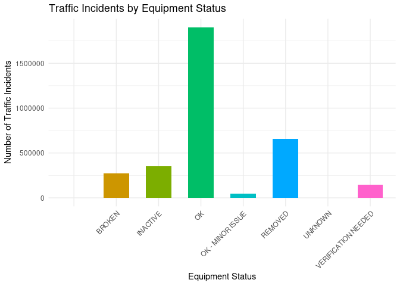
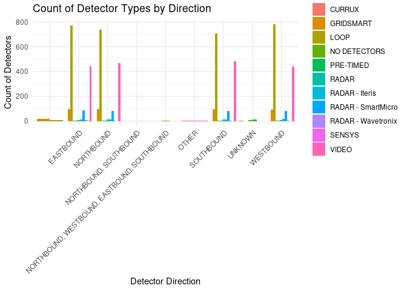
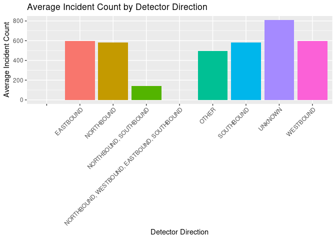
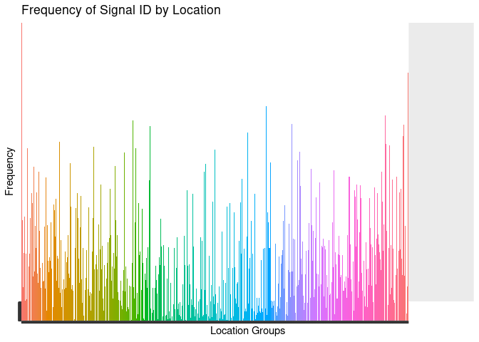

Camera Traffic Detectors
================

# Camera Traffic Detectors

## Overview

The data set under examination has been meticulously maintained and
updated by the Arterial Management Division of the City of Austin
Transportation & Public Works Department. This comprehensive dataset
provides in-depth information about various traffic detectors
strategically positioned at signalized intersections across Austin,
Texas. As of October 4, 2023, this dataset comprises a total of 5,759
rows and 15 columns, with each row corresponding to a unique traffic
detector.

Columns in the dataset, which are not limited to detector_id,
detector_type, detector_status, detector_direction, detector_movement,
location_name, and atd_location_id, jointly offer detailed insights into
each traffic detector. These include the types of detectors, their
operational statuses, the directions and movements they service, their
physical locations, and unique identifiers for their locations.

The first hypothesis seeks to explore the potential relationship between
detector types (Loop or Gridsmart) and their operational statuses (OK,
Broken, Removed, or Inactive). The assumption here is that due to
advanced technology, Gridsmart detectors might demonstrate superior
operational stability and lower failure rates compared to Loop
detectors. The null hypothesis for this scenario posits no significant
relationship between detector types and their operational statuses.

For the second hypothesis, the focus is on examining the relationship
between detector types and the direction of traffic they monitor. It’s
hypothesized that the distribution of detector types might vary across
different traffic directions, potentially due to installation
preferences or technological suitability for specific traffic flows. The
corresponding null hypothesis asserts that there is no significant
relationship between the types of detectors and the traffic directions
they monitor.

The third hypothesis explores a different aspect of the data, focusing
on the directional orientation of the detectors and its potential impact
on traffic incident frequencies. It is assumed there is a significant
correlation between the direction the traffic detector faces (e.g.,
North, South, East, West) and the frequency of traffic incidents in that
direction. Furthermore, it states that certain directions may have
higher incident frequencies, possibly due to factors like road design,
traffic flow, or other characteristics.

Our fourth and final hypothesis proposes The frequency of traffic
incidents is correlated with the physical placement location of the
traffic detectors. This hypothesis suggests that certain locations,
possibly due to higher traffic volume or complex traffic patterns, have
a higher frequency of incidents.

Through the rigorous testing of these hypotheses, the analysis aims to
unearth crucial relationships and patterns within the data set, thereby
offering valuable insights that the City of Austin could leverage to
enhance the efficiency and reliability of its traffic detection and
management systems. The results of the analyses will be depicted through
clear, accessible visualizations crafted using various data
visualization tools and techniques. This approach ensures that the
findings are easily understandable by audiences with varied technical
expertise, with a strong commitment to accuracy and thoroughness in
interpreting the data within the dataset.

## Link to Data

[Data
Set](https://data.austintexas.gov/Transportation-and-Mobility/Camera-Traffic-Counts/sh59-i6y9)

``` r
Traffic_Counts<- read.csv("Traffic_Detectors.csv")
library(ggplot2)
library(dplyr)
```

    ## 
    ## Attaching package: 'dplyr'

    ## The following objects are masked from 'package:stats':
    ## 
    ##     filter, lag

    ## The following objects are masked from 'package:base':
    ## 
    ##     intersect, setdiff, setequal, union

``` r
library(lubridate)
```

    ## 
    ## Attaching package: 'lubridate'

    ## The following objects are masked from 'package:base':
    ## 
    ##     date, intersect, setdiff, union

\#Visualization Number One

``` r
incident_summary <- Traffic_Counts %>%
  group_by(detector_status) %>%
  summarise(incident_count = sum(signal_id, na.rm = TRUE)) %>%
  arrange(-incident_count)

ggplot(incident_summary, aes(x = detector_status, y = incident_count, fill = detector_status)) +
  geom_bar(stat = "identity", show.legend = FALSE, width=0.6) +
  labs(
    title = "Traffic Incidents by Equipment Status",
    x = "Equipment Status",
    y = "Number of Traffic Incidents"
  ) +
  theme_minimal()+
  theme(axis.text.x = element_text(angle = 45, hjust = 1, vjust = 1))
```

<!-- -->

\#Visualization Number Two

``` r
type_by_direction <- Traffic_Counts %>%
  group_by(detector_type, detector_direction) %>%
  summarise(count = n()) %>%
  ungroup()
```

    ## `summarise()` has grouped output by 'detector_type'. You can override using the
    ## `.groups` argument.

``` r
ggplot(type_by_direction, aes(x = detector_direction, y = count, fill = detector_type)) +
  geom_bar(stat = "identity", position = "dodge") +
  labs(
    title = "Count of Detector Types by Direction",
    x = "Detector Direction",
    y = "Count of Detectors"
  ) +
  theme_minimal() +
  theme(axis.text.x = element_text(angle = 45, hjust = 1))
```

<!-- -->

\#Visualization Number 3

``` r
  Traffic_Counts %>%
     group_by(detector_direction) %>%
     summarise(average_incident_count = mean(signal_id)) %>%
     ggplot(aes(x = detector_direction, y = average_incident_count, fill = detector_direction)) +
     geom_bar(stat = "identity", show.legend = FALSE) +
     labs(title = "Average Incident Count by Detector Direction",
          x = "Detector Direction",
          y = "Average Incident Count") +
     theme(axis.text.x = element_text(angle = 45, hjust = 1))
```

    ## Warning: Removed 2 rows containing missing values (`position_stack()`).

<!-- -->

\#Visualization Number 4

``` r
library(dplyr)
library(ggplot2)
library(tidyr)
library(stringr)

ggplot(Traffic_Counts, aes(x = LOCATION, y = as.factor(signal_id), fill = LOCATION)) +
  geom_bar(stat = "identity") +
  labs(title = "Frequency of Signal ID by Location",
       x = "Location Groups",
       y = "Frequency") +
  theme(axis.text.x = element_blank(),
        axis.title.x = element_text(),
        axis.text.y = element_blank(),
        axis.title.y = element_text(),
        legend.position = "none") +
  coord_cartesian(xlim = c(0, 1100)) 
```

<!-- -->

\#Regression

We will utilize a linear Regression for Detector Age and Operational
Status: essentially using linear regression to model the relationship
between the age of detectors and the current operational status of the
detectors as analyzed through a numerical score.

``` r
  library(dplyr)
  library(ggplot2)
  library(lubridate)

Traffic_Counts1 <- Traffic_Counts %>%
  mutate(modified_date = mdy_hms(modified_date))  

Traffic_Counts2 <- Traffic_Counts1 %>%
  mutate(date_only = as.Date(modified_date)) %>%
  mutate(detector_status_num = case_when(detector_status == "OK" ~ 1,
                                         TRUE ~ 0))

Traffic_Counts3 <- Traffic_Counts2 %>%
  group_by(date_only)

model <- lm(detector_status_num ~ modified_date, data = Traffic_Counts3)
summary(model)
```

    ## 
    ## Call:
    ## lm(formula = detector_status_num ~ modified_date, data = Traffic_Counts3)
    ## 
    ## Residuals:
    ##     Min      1Q  Median      3Q     Max 
    ## -0.7464 -0.4428  0.2834  0.3269  1.8458 
    ## 
    ## Coefficients:
    ##                 Estimate Std. Error t value Pr(>|t|)    
    ## (Intercept)   -1.283e+01  3.221e-01  -39.83   <2e-16 ***
    ## modified_date  8.003e-09  1.923e-10   41.61   <2e-16 ***
    ## ---
    ## Signif. codes:  0 '***' 0.001 '**' 0.01 '*' 0.05 '.' 0.1 ' ' 1
    ## 
    ## Residual standard error: 0.434 on 5757 degrees of freedom
    ## Multiple R-squared:  0.2312, Adjusted R-squared:  0.2311 
    ## F-statistic:  1732 on 1 and 5757 DF,  p-value: < 2.2e-16

\#Explanation of Regression

The summary of this linear regression model will provide information
about the relationship between the modified date and the operational
status of the detectors. This model include coefficients for the
intercept and the slope of the variable modified date, which represents
the model’s estimation of the average starting value and the average
rate of change of the dependent variable with respect to the independent
variable. The standard errors, t-values, and p-values associated with
these coefficients help assess their significance in terms of how more
recently modified detectors may have varying operational statuses. A low
p-value suggests that the corresponding coefficient is statistically
significant, indicating a meaningful relationship. The R-squared value
indicates the proportion of variability in the dependent variable
explained by the model. Additionally, the residuals’ statistics provide
insights into the model’s goodness of fit and assumptions, helping to
evaluate if the model adequately captures the underlying patterns in the
data. Overall, the summary serves as a guide to interpreting how the
modification date of the detector may impact how it performs in order to
accurately capture the traffic patterns in Austin.
